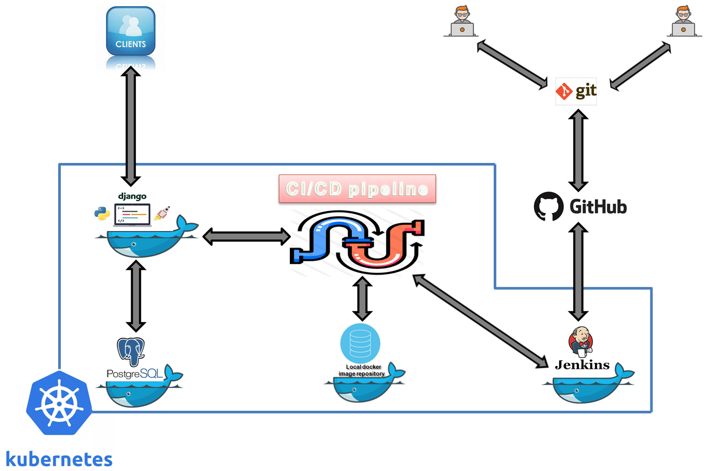

# Setup a CI/CD Pipeline using DevOps opensource tools
My goal is to show how to set up a fully-containerized Django web application in kubernetes with a simple CI/CD pipline to manage the deployements.

## Architecture diagram
 Check out the architecture diagram below to see what you’ll be building.
 
## Requirement
We will run this tutorial localy in Minikue and not on the cloud. You need a computer running an version of linux (In my case, I used ubuntu 16.04 lts ). Minimally, it should have 8 GB of RAM

## Tools installation 

###### GIT
```console
sudo add-apt-repository ppa:git-core/ppa
sudo apt-get update
sudo apt-get install git
```
###### Docker
```console
sudo apt-get update
sudo apt-get install apt-transport-https ca-certificates curl software-properties-common
curl -fsSL https://download.docker.com/linux/ubuntu/gpg | sudo apt-key add -
sudo add-apt-repository "deb [arch=amd64] https://download.docker.com/linux/ubuntu $(lsb_release -cs) stable"
sudo apt-get update
sudo apt-get install docker-ce
sudo docker run hello-world
sudo usermod -aG docker ${USER}
su - ${USER}
id -nG
```

###### docker-compose
```console
sudo curl -L https://github.com/docker/compose/releases/download/1.17.0/docker-compose-`uname -s`-`uname -m` -o /usr/local/bin/docker-compose
sudo chmod +x /usr/local/bin/docker-compose
docker-compose --version
```

###### Virtualbox
```console
sudo apt-get update
sudo apt remove virtualbox*
wget -q https://www.virtualbox.org/download/oracle_vbox_2016.asc -O- | sudo apt-key add -
wget -q https://www.virtualbox.org/download/oracle_vbox.asc -O- | sudo apt-key add -
sudo su
echo "deb https://download.virtualbox.org/virtualbox/debian xenial contrib" >> /etc/apt/sources.list
apt-get update
sudo apt-get install virtualbox virtualbox-ext-pack
```
###### Kubectl
```console
curl -LO https://storage.googleapis.com/kubernetes-release/release/v1.16.8/bin/linux/amd64/kubectl
chmod +x ./kubectl
sudo mv ./kubectl /usr/local/bin/kubectl
```
###### Kubectl
```console
curl -Lo minikube https://storage.googleapis.com/minikube/v1.3.1/latest/minikube-linux-amd64 && chmod +x minikube
sudo mv -v minikube /usr/local/bin
minikube version
```
###### Install your Python venv
Here's my pip list: 
```console
Django          2.2    
Pillow          6.1.0  
pip             19.2.3 
psycopg2        2.7.7  
psycopg2-binary 2.8.3  
pytz            2019.2 
selenium        3.141.0
setuptools      41.2.0 
sqlparse        0.3.0  
urllib3         1.25.9 
wheel           0.33.6 
```

## How to run it

#### clone the project from github
```console
git clone https://github.com/Radhouene1/DEVOPS_CICD.git
```

#### Test the Django app with postgresql using docker-compose

###### Setting up the postgresql in app_project/app/settings.py
```python
DATABASES = {
      'default': {
          'ENGINE': 'django.db.backends.postgresql',
          'NAME': 'postgres',
          'USER': 'postgres',
          'HOST': 'db', # set in docker-compose.yml
          'PORT': 5432 # default postgres port
      }
}
```

###### Build the app, make migrations and create a Django superuser
```console
docker-compose up --build
doccker ps
docker exec -it "C-ID"  bash
python manage.py migrate
python manage.py createsuperuser
exit

docker-compose up --build
```
###### Open this urls on the browser
```urls
http://127.0.0.1:8000/
http://127.0.0.1:8000/admin/login/?next=/admin/
```

#### setting up the CI/CD architecture 
###### Initialize minikube
Clear out Minikube :
```console
minikube stop; minikube delete; sudo rm -rf ~/.minikube; sudo rm -rf ~/.kub
```
Start up the Kubernetes cluster with Minikube, giving it some extra resources: 

```console
minikube start --memory 8000 --cpus 2 --kubernetes-version v1.11.0
```
Enable the Minikube add-ons Heapster and Ingress:
```console
minikube addons enable heapster; minikube addons enable ingress
```
View the Minikube Dashboard, a web UI for managing deployments:
```console
minikube dashboard
```
###### Create a Local Image Registry
```console
kubectl apply -f manifests/registry.yaml
kubectl rollout status deployment/registry
minikube service registry-ui
```

###### Deploy Jenkins Server

+ Build the Jenkins image to use in our Kubernetes cluster:
```console
docker build -t 127.0.0.1:30400/jenkins:latest -f manifests/Jenkins/Dockerfile manifests/Jenkins
```
+ Run the proxy container to push our jenkins image to the local image registry:
```console
docker build -t socat-registry -f manifests/socat/Dockerfile manifests/socat
docker stop socat-registry; docker rm socat-registry
docker run -d -e "REG_IP=`minikube ip`" -e "REG_PORT=30400" --name socat-registry -p 30400:5000 socat-registry
docker push 127.0.0.1:30400/jenkins:latest
minikube service registry-ui
docker stop socat-registry
```
+ Deploy Jenkins server:
```console
 kubectl apply -f manifests/jenkins.yaml
```
+ Jenkins Ui in a web browser: (It takes a several seconds)
```console 
minikube service jenkins
```
+ Display the Jenkins admin password with the following command:
```console
kubectl exec -it `kubectl get pods --selector=app=jenkins --output=jsonpath={.items..metadata.name}` cat /var/jenkins_home/secrets/initialAdminPassword
```
+ Copy the jenkins admin password and paste it, click continue.
+ Click install suggested plugins.
+ Create an admin user and credentials, and click save and continue.
+ Click Save and Finish. On the next page, click Restart. 
+ In Jenkins on the left, click on Manage Jenkins ,click on  Manage Credentials, select the Jenkins store, then Global credentials (unrestricted), and Add Credentials on the left menu.
+ The following values must be entered precisely as indicated:
    * Kind: Kubernetes configuration (kubeconfig)
    * ID: kenzan_kubeconfig
    * Kubeconfig: From a file on the Jenkins master
    * File: /var/jenkins_home/.kube/config
+ Finally click Ok.

###### Deploy the postgres database
Deploy:
```console
kubectl apply -f manifests/postgres.yaml
```
Connect [For django settings.py] : 
```console
sudo chmod a+x manifests/postgres/connect_to_postges.sh
manifests/postgres/connect_to_postges.sh
```
change db app/settings.py: (according to connect_to_postgres)
```python
DATABASES = {
        'default': {
              'ENGINE': 'django.db.backends.postgresql',
              'NAME': 'radhouene_db',
              'USER': 'admin',
              'PASSWORD' : 'admin',
              'HOST': '192.168.99.100', #
              'PORT': 31273 #
          }
    }
```
###### Deploy the Django app manually
Add the minikube local ip address to the allowed hosts in app_project/app/settings.py
```python
ALLOWED_HOSTS = ['192.168.99.100']
```
Build, proxy, push and deploy the app: 
```console
sudo chmod a+x scripts/app.sh
scripts/app.sh
```
Check deployments: 
```console
kubectl rollout status deployment/app
```
Create a Django super user: 
```console
eval $(minikube docker-env -u)
sudo kubectl exec -it `kubectl get pods --selector=app=app --output=jsonpath={.items..metadata.name}` bash
python manage.py migrate
python manage.py createsuperuser
```
Start the web application in the default browser :
```console
minikube service app
```

###### Cretaing a private github project
+ go to : https://github.com/ and sign in with your account
+ Click on new repository
+ Enter the Repository name : R_BHA_DEVOPS_CICD
+ Select : Initialize this repository with a README
+ Click on Create repository
+ Go to your linux terminal under your project folder [preferred same name as github repository] and type the following cmds:
```console
git init
git remote add origin "https://github.com/Radhouene1/R_BHA_DEVOPS_CICD.git"
git add -A
git commit -a -m "Push the project files"
git push origin master --force
```
###### Creating the app pipline in jenkins
+ Integrate Jenkins with Github (Private repo):
```console
kubectl exec -it `kubectl get pods --selector=app=jenkins --output=jsonpath={.items..metadata.name}` -c jenkins bash
ssh-keygen -t rsa -b 4096 -C "bha.radhouene@gmail.com"
cat /var/jenkins_home/.ssh/id_rsa.pub [copy the key]
```
+ Go to your private Github repo -> Settings -> Deploy keys -> Add deploy key
    * Title : jenkins ssh key
    * Key: copy the id_rsa.pub
    * check "Allow write access"
+ In Jenkins on the left, click on Manage Jenkins ,click on  Manage Credentials, select the Jenkins store, then Global credentials (unrestricted), and Add Credentials on the left menu.
    * Kind: SSH User with private key
    * Id: github_ssh_key
    * username: Jenkins
    * Private Key : enter directly
    ```console
    kubectl exec -it `kubectl get pods --selector=app=jenkins --output=jsonpath={.items..metadata.name}` -c jenkins bash
    cat /var/jenkins_home/.ssh/id_rsa [copy it and paste it]
    ```
 + Open the Jenkins UI in a web browser:
 ```console
 minikube service jenkins
```
+ On the left in Jenkins, click New Item.
+ Enter the item name as [R_BHA_DEVOPS_CICD], click Pipeline, and click OK.
+ Under the Build Triggers section, select Poll SCM. For the Schedule, enter the string * * * * * which will poll the Git repo every 1 minute for changes.
+ In the Pipeline section, change the following:
    * Definition: Pipeline script from SCM
    * SCM: Git
    * Repository URL: git@github.com:Radhouene1/R_BHA_DEVOPS_CICD.git
    * Credentials: Choose "Jenkins"
    * Script Path: Jenkinsfile
+ Click Save. On the left, click Build Now to run the new pipeline

#### Testing the DevOps CICD Pipeline
+ Change the httpResponnse of the home page view in app_project/accounts/views.py
```python
def homePageView(request):
    return HttpResponse(' !! Test DevOps CICD !! \n')
```
+ Commit the changes and see the results: 
```console
git add -A
git commit -a -m "Test Pipeline"
git push origin master --force
```

## cleanning up

###### application 
```console 
sudo chmod a+x scripts/cleanup_app.sh
scripts/cleanup_app.sh
```

###### postgres db
```console 
sudo chmod a+x manifests/postgres/cleanup.sh
manifests/postgres/cleanup.sh
```

###### docker
```console
docker system prune
docker system prune -a
docker volume prune
```

###### minikube
```console 
minikube stop; minikube delete; sudo rm -rf ~/.minikube; sudo rm -rf ~/.kub
```

## Demo video 
Coming soon

